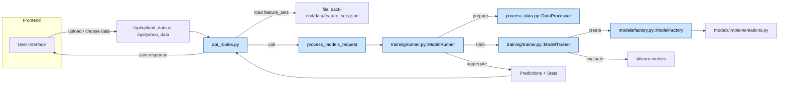

# Backend API Flow

This page documents the high-level API flows. Diagrams are rendered using Mermaid.

## Endpoints covered

- `POST /api/upload_data` — accepts CSV uploads and returns time series JSON
- `POST /api/yahoo_data` — fetches historical data from Yahoo Finance
- `GET /api/feature_sets` — returns available feature set definitions
- `POST /api/run_models` — primary business endpoint: runs models and returns predictions and statistics

## API flow (overview)

## Notes
- The flow shows the logical responsibilities — details (caching, grouping) are shown in the model running doc.
- `process_models_request` (in `services/model_service.py`) is the business-logic bridge used by the API to invoke the runner and collect results.
