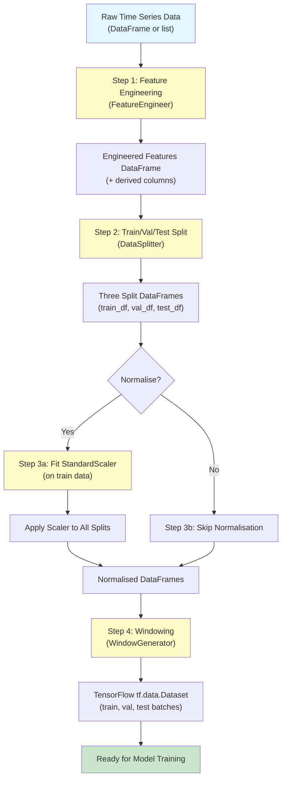
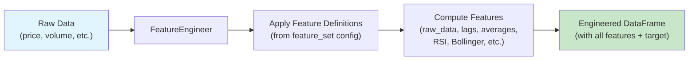
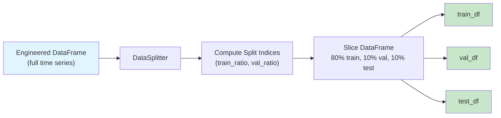
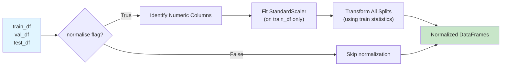
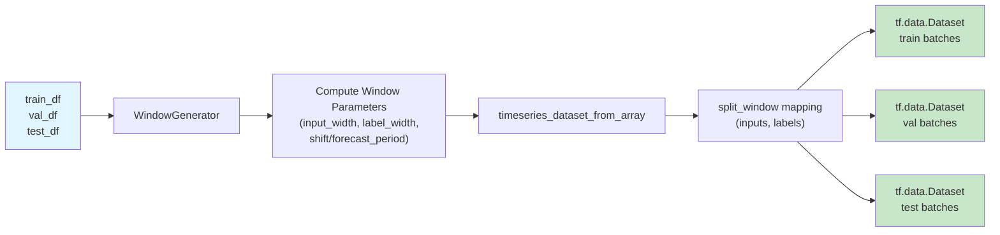
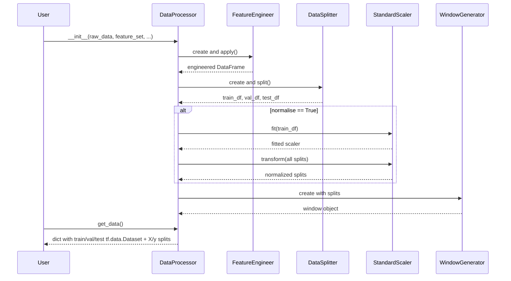

# Data Processing Pipeline

This document describes the data processing pipeline orchestrated by `process_data.py` and the `DataProcessor` class. The pipeline prepares raw time series data for machine learning models through feature engineering, splitting, normalization, and windowing.

## Overview

The `DataProcessor` class handles the entire workflow from raw data to windowed TensorFlow datasets ready for model training. The pipeline is deterministic and reusable, allowing multiple models to share the same processed data.

## High-level process flow



## Detailed step-by-step flow

### Step 1: Feature Engineering



**Inputs:**
- `raw_data`: DataFrame or dict list with OHLCV data
- `feature_set`: Configuration dict specifying which features to compute
  - Defined in `back-end/data/feature_sets.json`
  - Contains `features` list and optional `target` spec

**Outputs:**
- Engineered DataFrame with derived features (e.g., Close_lagged_1, RSI, Bollinger bands)
- Target column (usually `target` created from the target spec)

**Key code:**
```python
fe = FeatureEngineer(self.raw_df, feature_set)
self.df = fe.apply().dropna()
target_col = self.get_target()
```

### Step 2: Train/Val/Test Splitting



**Inputs:**
- Engineered DataFrame
- `train_ratio` (default 0.8): proportion for training
- `val_ratio` (default 0.1): proportion for validation
- Remainder goes to test

**Outputs:**
- Three DataFrames: `train_df`, `val_df`, `test_df`

**Key code:**
```python
splitter = DataSplitter(self.df, train_ratio, val_ratio)
self.train_df, self.val_df, self.test_df = splitter.split()
```

### Step 3: Normalization (Optional)



**Inputs:**
- `normalise` flag (boolean)
- Train, validation and test DataFrames

**Process:**
- If `normalise=True`:
  1. Fit `StandardScaler` on training data only (prevents data leakage)
  2. Transform validation and test using training statistics
  3. Store scaler for inverse transformation later (e.g., when displaying predictions)

**Outputs:**
- Normalized DataFrames (or unchanged if `normalise=False`)
- Scaler instance saved as `self.scaler` for inverse transforms

**Key code:**
```python
if self.normalise:
    numeric_cols = self.train_df.select_dtypes(include=["number"]).columns
    self.scaler = StandardScaler()
    self.scaler.fit(self.train_df[numeric_cols])
    self.train_df.loc[:, numeric_cols] = self.scaler.transform(...)
    # ... repeat for val and test
```

### Step 4: Windowing



**Inputs:**
- Normalized DataFrames
- `input_width`: number of timesteps to look back (e.g., 10)
- `forecast_period` (shift): forecast horizon (e.g., 1 day ahead)
- `label_width`: typically 1 (single-step prediction) or equals `forecast_period`

**Process:**
1. Compute total window size = `input_width + forecast_period`
2. Use `tf.keras.utils.timeseries_dataset_from_array` to create sliding windows
3. Map windows through `split_window()` to separate inputs and labels
4. Return as `train`, `val`, `test` properties

**Example:**
- If `input_width=10`, `forecast_period=1`:
  - Each window uses 10 timesteps as input
  - Predicts 1 timestep ahead
  - Window size = 11

**Outputs:**
- `tf.data.Dataset` objects ready for TensorFlow model training
- Batched into groups (default batch_size=32)

**Key code:**
```python
self.window = WindowGenerator(
    input_width=self.input_width,
    label_width=1,
    shift=self.forecast_period,
    train_df=self.train_df,
    val_df=self.val_df,
    test_df=self.test_df,
    label_columns=["target"]
)
```

## Complete pipeline sequence diagram



## API: `DataProcessor.get_data()`

The primary method to retrieve processed datasets:

```python
processed_data = data_processor.get_data(forecast_period=None)
```

**Returns dict with keys:**
- `'train'`, `'val'`, `'test'`: `tf.data.Dataset` objects (batched windows)
- `'x_train'`, `'y_train'`: training features (DataFrame) and target (Series)
- `'x_val'`, `'y_val'`: validation features and target
- `'x_test'`, `'y_test'`: test features and target

## Inverse transformation (denormalization)

After model training and prediction, denormalize predictions if needed:

```python
if data_processor.get_normalise():
    target = data_processor.get_target()
    y_pred_denorm = data_processor.inverse_transform(y_pred, target)
```

This uses the fitted scaler to reverse the normalization, so predictions are on the original scale.

## Caching and reuse

`ModelRunner` caches `DataProcessor` instances keyed by:
```python
config_key = (feature_set_name, forecast_period, input_width, normalise)
```

When multiple models use the same feature set and parameters, the cached `DataProcessor` is reused, avoiding duplicate feature engineering and windowing work.

## Common edge cases

1. **Short time series**: If the total number of samples is less than the total window size, `WindowGenerator` produces zero windows. Models should handle or error gracefully.

2. **Missing or invalid features**: If a feature specified in the feature set cannot be computed, `FeatureEngineer.apply()` may raise an error or produce NaN. Rows with NaN are dropped with `.dropna()`.

3. **Non-numeric columns**: Only numeric columns are normalized; categorical or string columns are excluded from the scaler.

4. **Date alignment**: `WindowGenerator` uses DataFrame indices; ensure dates are preserved as DataFrame indices (or separate column) if timestamps are needed for visualization.

## Configuration example

Feature set JSON (from `feature_sets.json`):

```json
{
  "Daily_data_historical": {
    "features": [
      {
        "name": "close",
        "function": "raw_data",
        "input_data_fields": ["close"]
      },
      {
        "name": "close_lag_1",
        "function": "create_lag",
        "input_data_fields": ["close"],
        "function_parameters": {"num_lags": 1}
      }
    ],
    "target": {
      "function": "raw_data",
      "input_data_fields": ["close"],
      "name": "target"
    },
    "data_type": "daily"
  }
}
```

Then:

```python
data_processor = DataProcessor(
    raw_data=df,
    feature_set=feature_set_manager.get_feature_set("Daily_data_historical"),
    forecast_period=1,
    input_width=10,
    normalise=True,
    train_ratio=0.8,
    val_ratio=0.1
)

processed_data = data_processor.get_data()
# processed_data['train'], processed_data['val'], processed_data['test'] are ready for models
```

