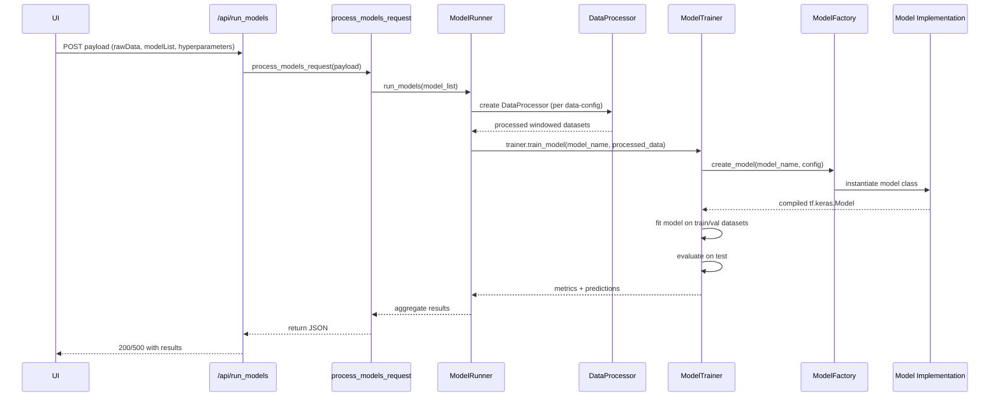
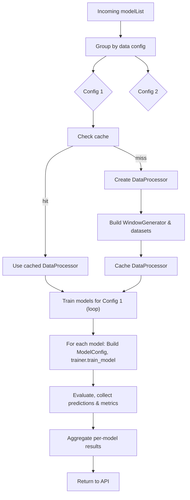

# Model running: detailed design and flow

This document explains the model-running pipeline in detail and includes Mermaid diagrams for visualising the sequence and data flow.

## Contract (inputs / outputs / error modes)

- Inputs (to `/api/run_models` business logic):
  - rawData: list of time series rows (dicts) or a DataFrame-like structure
  - modelList: array of model configuration objects (fields: name, model, featureSet, params, forecastPeriod, inputWidth, normalise)
  - hyperparameters: optional dict containing train/val/test split and other run-level options

- Outputs: JSON
  - metadata: run-level metadata
  - dates: array of timestamps (aligned to the test split)
  - actual: ground-truth values for test set
  - predictions: map modelName -> list of predicted values
  - stats: map modelName -> metrics such as mse, mae, rmse, r2

- Error modes:
  - Bad client payload → 400
  - Model errors per-model → returned in `stats[model]` or `errors` while other models continue
  - All models failing → 500

## Sequence diagram (high-level)



## Flowchart (grouping & caching)



## Developer notes, edge cases and tips

- Edge case: very short time series — WindowGenerator may produce zero windows. The pipeline should detect and return a helpful error.
- Caching: ModelRunner caches `DataProcessor` instances keyed by (featureSet, forecastPeriod, inputWidth, normalise). Clear the cache when raw data changes.
- Determinism: use fixed seeds inside model implementations where reproducibility is required.
- Performance: for many models sharing the same features, grouping reduces repeated feature-engineer + scaler + window building.

## How to run locally (developer)

1. Start the Flask backend (from `back-end/`):

```powershell
# from the repo root
cd back-end
# use your virtualenv / python executable
python app.py
```

2. Send a POST to `/api/run_models` with a JSON payload. Example (simplified):

```json
{
  "rawData": [{"date":"2020-01-01 00:00:00","target":1.0,...}, ...],
  "modelList": [{"name":"Baseline","model":"baseline","featureSet":"Baseline_daily_data","params":{},"forecastPeriod":1}],
  "hyperparameters": {"train_val_test_split": [0.8,0.1,0.1]}
}
```


